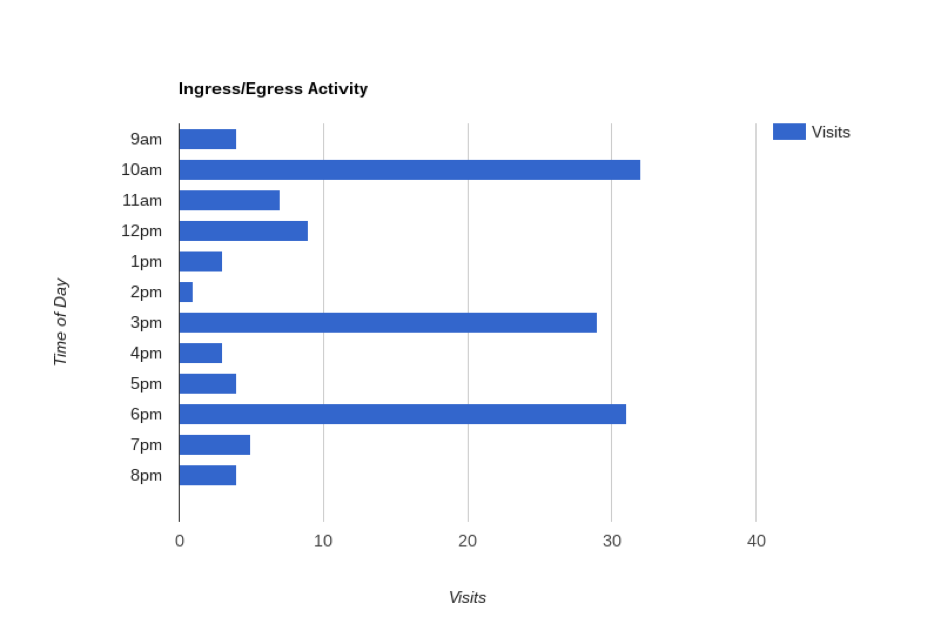
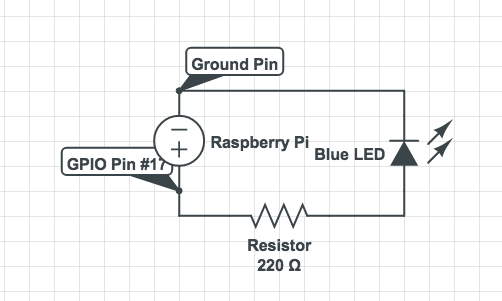
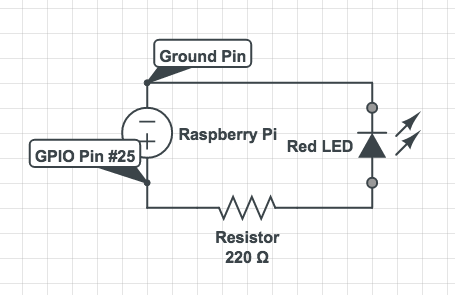
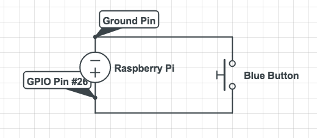
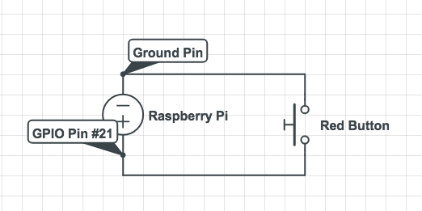

gamewarden
==========

GameWarden is a concealable device that uses wireless traffic to calculate peak hours of use for a building entrace. It is designed to help operators make informed decisions about when to attempt to tailgate into a building during physical security assessments. GameWarden is inspired by systems used by many retail outlets to track peak hours and repeat visits to their stores [1]. A study by the Pew Research Center revealed that 92% of Americans own a cell phone and that 90% of cell phone owners carry their cellular device with them “frequently” [2]. Since wireless devices transmit probe frames at consistent and frequent intervals, this high rate of adoption implies that wireless devices can be used to detect foot traffic through a physical location [1].

GameWarden is battery powered and can easily be concealed near building entrances. It detects when wireless devices are within close proximity by sniffing 802.11 probe frames using a low power antenna. The packet sniffing capability can be easily activated by pressing a button on the side of the device. The data collected by GameWarden includes timestamps, MAC addresses, and sequence numbers. The MAC addresses and sequence numbers are used to identify individual devices, and the timestamps are used to determine peak hours of activity.

Captured data can be exfiltrated from the GameWarden device using its built-in wireless access point. The access point can be concealed by hiding its ESSID, and can be protected using WPA2-PSK and a strong passphrase. To conserve precious battery life and evade detection, GameWarden can be programmed to automatically activate and deactivate its built-in access point at scheduled times. Future iterations of GameWarden will have the capability to exfiltrate data over SMS. 

Once the captured data is exfiltrated from the device, it can be parsed offline using GameWarden’s analysis engine. The analysis engine works by aggregating timestamps into a histogram of half hour intervals, an example of which is shown above.

Shoutout to [@daemonhunter](https://twitter.com/daemonhunter) for coming up with a name for this crazy thing.

\[1\] http://www.nytimes.com/2013/07/15/business/attention-shopper-stores-are-tracking-your-cell.html

\[2\] http://www.pewinternet.org/2015/08/26/chapter-1-always-on-connectivity/

Table Of Contents
=================

   * [Usage Instructions](#usage-instructions)
      * [1. Configuring the GameWarden device](#1-configuring-the-gamewarden-device)
      * [2. Connect the GameWarden device to a power source](#2-connect-the-gamewarden-device-to-a-power-source)
      * [3. Enable GameWarden's packet sniffer](#3-enable-gamewardens-packet-sniffer)
      * [4. Conceal the GameWarden device](#4-conceal-the-gamewarden-device)
      * [5. Manually Enabling GameWarden's AP](#5-manually-enabling-gamewardens-ap)
      * [6. Exfiltrating and Analyzing Data From GameWarden](#6-exfiltrating-and-analyzing-data-from-gamewarden)
   * [First Time Setup](#first-time-setup)
      * [1. Installing Raspbian-Lite on the Raspberry Pi 3](#1-installing-raspbian-lite-on-the-raspberry-pi-3)
      * [2. Installing and Configuring the GameWarden software on the Raspberry Pi 3](#2-installing-and-configuring-the-gamewarden-software-on-the-raspberry-pi-3)
      * [3. Assembling the GameWarden Device](#3-assembling-the-gamewarden-device)

Usage Instructions
==================

GameWarden is designed to be used in the manner outlined in the following steps.

1. Configure the GameWarden device
2. Connect the GameWarden device to a power soure
3. Press the Blue button to enable GameWarden's packet sniffer
4. If you've configured GameWarden to enable its access point on a schedule, skip to step 5. Otherwise, hit the red button to enable its built-in access point. 
5. Conceal the GameWarden device near a door or other entry point.
6. When you're ready to exfiltrate data from the GameWarden device, connect to its built-in AP and use the gw-analyzer script to exfiltrate and analyze the data.

For detailed instructions on how to complete each of the following steps, please refer to the appropriate section below.

1\. Configuring the GameWarden device
-------------------------------------

If this is your first time configuring and running GameWarden, please complete the _First Time Setup_ guide before proceeding with this section.

Begin by using SSH to connect to your GameWarden device. Then run setup.py to reinitialize GameWarden's databases. Note that this will delete any previously saved entries in your GameWarden databases, so make backups if you want to keep your previous work.

	python setup.py

Next, decide whether you want to run GameWarden's access point on a schedule or run it continuously. Running GameWarden's access point on a schedule is recommeneded for two reasons:

1. It's stealthier
2. It conserves battery life

If you're planning on running the AP on a schedule, use the following command to launch the scheduler's setup wizard. Then follow the prompts.

	./gamewarden --set-schedule

Once you've configured the scheduler (or decided not to), proceed to configuring GameWarden's builtin access point using the following command. GameWarden will provide you with an easy to use wizard, so just enter in desired config values as prompted.

	./gamewarden --ap-config

Your GameWarden device should now be configured and ready to use.

2\. Connect the GameWarden device to a power source
---------------------------------------------------

GameWarden can be run off of a variety of different power sources. Just make sure that whatever you're plugging it into can connect to its microusb power port. We recommend using something like a [Mophie battery](http://www.mophie.com/) for situations in which a power outlet isn't available 9. Otherwise, plug it into a concealed power outlet and adorn it with a label stating "Do not touch. -IT". 

Important note: it is entirely on you to power your GameWarden device is a manner that is safe and legal. The author of GameWarden's source code is not responsible for any damanges caused by your bad/dangerous electrical 

3\. Enable GameWarden's packet sniffer
--------------------------------------

To enable GameWarden's packet sniffer, use the blue button attached to the side of the device.

4\. Conceal the GameWarden device
---------------------------------

GameWarden should be concealed in a location that will not interfere with wireless reception and where it won't become a fire hazard.

5\. Manually Enabling GameWarden's AP
-------------------------------------

To manually enable GameWarden's AP, press the red button attached to the side of the device. 

6\. Exfiltrating and Analyzing Data From GameWarden
---------------------------------------------------

To exfiltrate and analyze data from the GameWarden device, first connect to its built-in access point. Then run following
command. 

	./gw-analyzer --retrieve

Then use the following command to analyze and the results. 

	./gw-analyzer --analyze --show

The resulting PNG file will be stored in your gamewarden/png-stash directory.

You can also combine the last two commands as follows:

	./gw-analyzer --analyze --show --retrieve

The following options are also included:

- --db-file
- --db-stash
- --output
- --remote-install-path
- --collector-ip

Run the following command if you want to learn more about them.

	./gw-analyzer -h

First Time Setup
================

To complete this guide, you'll need the following hardware components:
- 1 Raspberry Pi 3 Model B (with microSD and power supply)
- 2 TP-Link WN722N external wireless adapters
- 1 red LED 
- 1 blue LED
- 2 tactile push switches
- 2 220 Ohm resistors 
- 1 ruggedized case for the Raspberry Pi 3 Model B

The following items are not required but are highly recommended:
- 1 breadboard with jumper cables for test purposes
- 1 Adafruit T-Cobbler Plus GPIO breakout kit for test purposes
- high capacity external battery

It is recommended that you install the GameWarden software component before assembling the hardware. 

The following steps must be completed in order to build and configure a GameWarden device:
1. Install Raspbian-Lite on the Raspberry Pi 3
2. Install and Configure the GameWarden software on the Raspberry Pi 3
3. Assemble the GameWarden device

Please refer to the appropriate section below for each of the steps listed above.

1\. Installing Raspbian-Lite on the Raspberry Pi 3
--------------------------------------------------

It is very likely that your Raspberry Pi 3 ships with the NOOBS installation software preloaded on an included microSD card. If that's the case, just select Raspbian-Lite as your installation option. Otherwise, there are plenty of online resources to guide you through Raspbian-Lite installation process. Remember to change the default password on your device. Or don't. It's up to you.

2\. Installing and Configuring the GameWarden software on the Raspberry Pi 3
----------------------------------------------------------------------------

Gamewarden is intended to be installed on a Raspberry Pi microcontroller running Raspbien-Lite. Python code targets _Python 2.7_.

Pretty much everything in this section should be run as root, so begin by executing the following command.

	sudo -s

Once that's done, install dependencies as follows:

	apt-get install rfkill hostapd dnsmasq python-pip python3 python3-pip git

Next, cd into your /opt directory and clone the GameWarden repo using the following command:

	cd /opt && git clone https://github.com/s0lst1c3/gamewarden.git

Then install Python dependencies using pip:

	pip install -r pip.req

Once that's done, add the following line to your /etc/rc.local file (before the 'exit 0' command at the end of the file):

	/opt/gamewarden/gw-listener

Finally, reboot the device using the following command:

	shutdown -r now

3\. Assembling the GameWarden Device
------------------------------------

GameWarden doesn't use a lot of external parts. Regardless, if you're new to hardware the schematics included in this section may appear dauntning. Don't worry, they're not actually that bad. If you're unsure of how to complete this section, [order one of these for 20 bucks on Amazon](https://www.amazon.com/gp/product/B017C54VZA/ref=oh_aui_detailpage_o02_s00?ie=UTF8&psc=1). It comes with a short, easy to digest guidebook. By the time you reach page 10, you'll know what to do with the schematics.

It is recommended that each of the circuits below be completed and tested using a breakout board before attempting any soldering.

The first step is to create a circuit to control the blue LED. To do this, connect GPIO Pin #17 to a 220 Ohm resistor. Connect the negative (unused) end of the 220 Ohm resistor to the anode (positive) end of the blue LED (hint: it's the end with the longer piece of wire). Connect the cathode (negative) end of the blue LED (the end with the shorter piece of wire) to an unused ground pin.

The second step is to create a circuit to control the red LED. To do this, connect GPIO Pin #25 to a 220 Ohm resistor. Connect the negative (unused) end of the 220 Ohm resistor to the anode (positive) end of the red LED (hint: it's the end with the longer piece of wire). Connect the cathode (negative) end of the red LED (the end with the shorter piece of wire) to an unused ground pin.

The third step is to create a circuit to receive input from the blue button. Connect one end of the button to GPIO Pin #26. Connect the other end of the button to an unused ground pin.

The fourth step is to create a circuit to receive input from the blue button. Connect one end of the button to GPIO Pin #26. Connect the other end of the button to an unused ground pin.

Test these circuits out by booting up the GameWarden device and then hitting the blue button. This should start the packet sniffer. Hit the blue button again. This should stop the packet sniffer. Next, do the same with the red button to start and stop the built-in access point. 

If everything is working correctly, solder together a more permanent version, integrating it with the case you're using. Plug in the two external wireless adapters and add your external battery if you're using one. Congratulations: your GameWarden device is ready for use.
